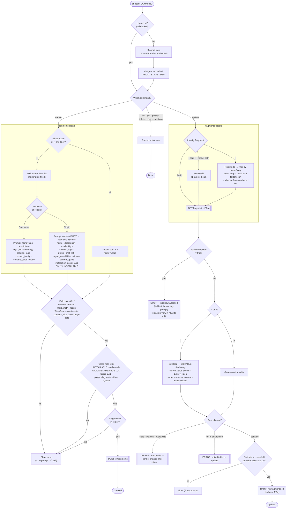

# cf-agent — Complete Flow

A single flowchart covering every scenario: authentication, command dispatch, **create** (connector/plugin, interactive & one-liner), **update** (by id / slug / interactive picker, review-lock, editable-field scoping), validation, and the final write. Rendered with [Mermaid](https://mermaid.js.org) (native in VSCode + GitHub).

## Editable fields on update (the `Field allowed?` gate)

| Model | Editable | Locked (immutable) |
|---|---|---|
| **Connector** | `logo`, `content_guide` | `slug` |
| **Plugin** | `marketplace_name`, `description`, `purple_chat_link`, `solution_tags`, `installation_asset_uuid`, `content_guide` | `slug`, `systems`, `availability` |

Everything not listed as editable is rejected on update.

## Legend

| Shape | Meaning |
|---|---|
| `([ ])` | Start / end |
| `{ }` | Decision (a gate) |
| `[[ ]]` | AEM API call, or a hard stop / error |
| `[ ]` | Step / prompt |

**Key behaviors encoded:** live-model validation · plugin systems-first slug seeding · conditional `installation_asset_uuid` · logo filename auto-prefix · duplicate-slug guard · UUID-less fragment selection (id / slug / interactive filter) · review-lock fail-fast · journey-scoped editable fields · merged-state cross-field check on update.
